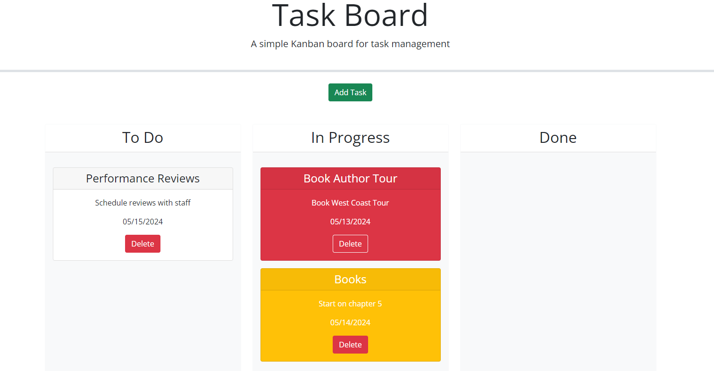

# Third-Party APIs Challenge: Tuesday Task Board

## User Story 
As a project manager, I want to develop a task board so I can add, manage and track tasks.

## Description
The Task Board is an interactive webpage that allows you to add, drag and delete tasks.
A new task can be created by clicking Add Task. Once the task is created, it can be dragged to any swim lane.
If a task is near its deadline, the task will turn yellow. If its overdue, it will turn red. Tasks can also be deleted to show its been completed. 

## Screenshots

## Deployed Link

https://marissamelo91.github.io/Tuesday-Task-Board/

## Credits
- [Bootstrap](https://getbootstrap.com/)
- Tutor Sessions
- Classmates
- Youtube, BroCode 